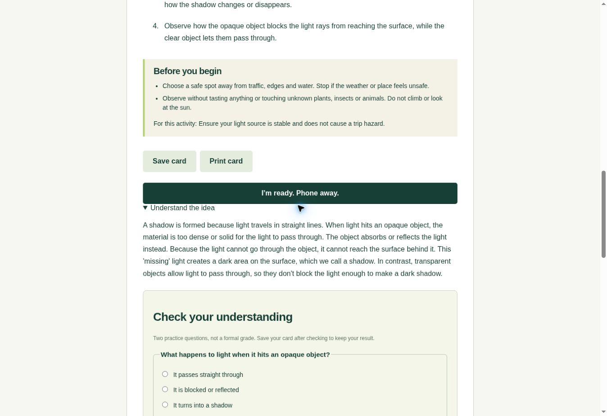

# OutsideClass

Created and maintained by **Paul Ayoade David** ([PHONIEXz](https://github.com/PHONIEXz)).

**A little less screen. A little more world.** Ask a learning question, read a short field card, put the phone away, and return with evidence of what you noticed.

[Try OutsideClass](https://outsideclass-phoenix.vercel.app/) · [Report a problem](https://github.com/PHONIEXz/OutsideClass/issues)



## Author and attribution

OutsideClass was created by **Paul Ayoade David**, a teacher and cybersecurity student, to connect learning questions with observations in the world around us.

- **Creator and maintainer:** Paul Ayoade David
- **GitHub:** [PHONIEXz](https://github.com/PHONIEXz)
- **Original repository:** [PHONIEXz/OutsideClass](https://github.com/PHONIEXz/OutsideClass)

The application source is shared under the [MIT licence](LICENSE). When reusing copies or substantial portions of the code, preserve the copyright and licence notices required by that licence. If you share a fork or adaptation, please also credit Paul Ayoade David and link to this original repository.

## What you can do

- Ask your own question. Get a nearby observation activity when one fits, or a direct explanation when it does not.
- Adapt lessons to young learners, families or classes, weather, time available, and seated or window-based participation.
- Ask about two selected images, with consent before sending them to Google AI.
- Use learning illustrations or external references, then attach your own evidence photos.
- Check understanding, explore a next question, and save reflections and practice results.
- Return to a named spot, compare discoveries, and download or restore backups with photos.
- Print lessons or exchange classroom activity packs and learner work files.

Home, Activities, Notebook, Guides and Updates have separate URLs. Updates are available through [RSS](https://outsideclass-phoenix.vercel.app/updates.xml); no email subscription is collected.

## Try it without an API key

Install Node.js 22 or newer, clone this repository, and run:

```bash
npm run dev
```

Open <http://localhost:3000>. There are no application dependencies to install. Three labelled, prewritten sample activities work without credentials and include practice questions. Save a sample, attach a photo, and reopen it from Notebook.

## How the AI works

**OutsideClass AI** turns learning questions into explanations and activities using Google-hosted Gemma. Submitted questions and consented images are processed by Google.

Copy `.env.example` to `.env`, set `GEMMA_API_KEY` to your Google AI Studio API key, and set `GEMMA_MODEL` to a Gemma model available to your account. Restart the server. Keep `.env` out of version control; the key is used only on the server.

The starting configuration uses `gemma-4-26b-a4b-it` through Google's Gemini API. The API is the hosting interface; the requested model is Gemma. See [Google's Gemma API documentation](https://ai.google.dev/gemma/docs/core/gemma_on_gemini_api) for availability and terms.

The server validates bounded inputs, applies a timeout, requests structured output, and rejects malformed or incomplete responses. App-written safety notes supplement model output. Generated answers can still be wrong: an adult should review lessons for children, and practice results are not formal grades or proof of mastery.

## Privacy and saved work

Choose an optional first name or nickname and Learner, Teacher or Parent role in the local profile panel. It personalizes your greeting and notebook label without a login, phone number or verification code. These preferences stay in this browser, are not sent to AI, and are excluded from notebook downloads. You can edit or clear the profile without deleting your learning work. It is not an account: anyone using the browser can change it, and it provides no identity verification, device sync or recovery.

Generating a card sends your question and choices to Google, including a spot nickname if supplied. Follow-ups send the displayed earlier question and answer; return visits send the displayed observation context. Use nicknames rather than addresses or personal details. Selected question images are sent only after consent and are resized to JPEG first.

Saved cards and reflections live in this browser's localStorage; evidence photos live in IndexedDB. Notebook photos are not automatically sent to the model. No account, GPS, camera or microphone access is required.

Clearing browser data can erase your notebook. Storage is device-local and capped at 100 cards; new cards are refused at the limit so existing work is kept. Back up your notebook before deleting cards to make room. Download a backup to keep a separate copy. Backups and learner work exports include notes and photos, so share them deliberately. Imports add missing IDs without overwriting existing cards or evicting cards. Activity packs exclude personal reflections, photos and previous conversation context.

## Offline use and mobile

After a successful online visit installs the service worker, cached pages, samples and saved cards can open offline. AI questions and external image references require internet. The timer can recover after refresh but does not provide a background alarm.

The current release is a website, not an Android or iOS package. Native packaging is planned after launch verification. Accounts, automatic cloud backup, device sync and a live classroom dashboard are not included; classroom exchange currently uses files.

## Run checks

```bash
npm test
npm run build
```

As of 8 October 2026, all 72 automated tests and syntax checks pass. Tests cover validation, provider failures, safety context, storage failures, consent, scoring, backup rollback, timer recovery and per-instance rate limiting. Live browser checks verified practice scoring, saved progress, notebook download, duplicate-safe import and photo evidence. A live image question returned a relevant description and two practice checks. These show functioning flows, not guaranteed factual accuracy or child safety.

A subsequent desktop keyboard pass reached every generation control in order and submitted a live Gemma question. Restoring a backup into an empty browser notebook recovered two cards, a reflection, practice scores and both evidence photos. On 8 October 2026, the project owner reported testing on a phone with all tested flows working. The device, browser and individual checks were not recorded. Explicit airplane-mode recovery, a complete accessibility audit and a real outdoor lesson remain launch requirements. Real-world observations should come from learners, not generated examples.

## Deploy

Import this repository into Vercel using the Other framework preset, build command `npm run build`, and output directory `public`. Add `GEMMA_API_KEY` and `GEMMA_MODEL` as server environment variables. Test a generation and notebook recovery on the deployed URL.

Before broad public use, configure Google quota controls and platform rate limiting for `/api/activity`. The built-in limiter allows six requests per minute per forwarded connection per Vercel instance; it resets with instances and is neither distributed protection nor a hard spending cap. Check account-specific quotas and billing settings before enabling paid inference.

## Source layout

| Path              | Purpose                                                            |
| ----------------- | ------------------------------------------------------------------ |
| `public/`         | Pages, styles, browser modules, samples and offline service worker |
| `api/activity.js` | Vercel request handler and hosted inference                        |
| `lib/`            | Prompt construction, validation and request limits                 |
| `server.mjs`      | Dependency-free local server                                       |
| `test/`           | Node built-in tests                                                |

MIT-licensed application source. Gemma usage is subject to Google's applicable model and service terms.

## Publish an update

The Updates page has search, Product/Fixes/Learning tips categories, full-post sections and copyable links. RSS subscriptions use a feed reader; copying the address alone is not a subscription, and no email or push alerts are sent.

Edit `public/updates.json` to add a post with a unique, permanent `id`, title, UTC `publishedAt`, category, summary and body paragraphs. An optional action can link to an existing app page. Keep published IDs unchanged so existing RSS readers recognize the same posts. Run `npm run updates` or `npm run build` to generate both the page and `/updates.xml`, then commit the JSON and generated files together. Run `npm test` to check feed consistency. Learning tips are suggestions, not fabricated reports of outdoor lessons.

## Web launch verification

See [the verification record](docs/web-launch-verification.md) for automated coverage, the manual browser checks, and the remaining account/device steps. The API can be paused without disabling saved work by setting server-only `GEMMA_DISABLED=1` and redeploying. This stops provider calls; it is an emergency control, not a quota cap.
